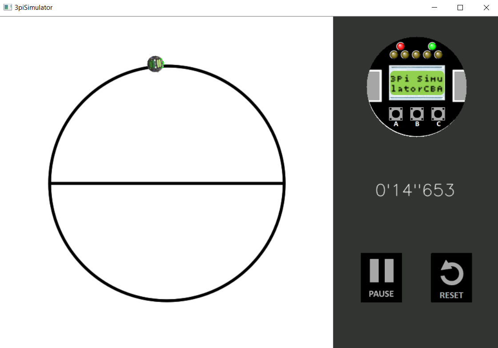
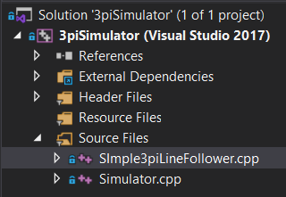

# 3pi Simulator



Este projeto é um simulador 2D para o robô Pololu 3pi, tipicamente usado como seguidor de linha.

O simulador funciona de forma a implementar as mesmas biblioteca usadas pelo 3pi no Arduino IDE. Por exemplo, o método ```readLine```, da biblioteca ```Pololu3pi.h```, usado no Arduino IDE, pode ser usado também no simulador. Isto significa que é possível **copiar e colar** o código de controle do 3pi do Arduino IDE para nosso projeto, e assim simular o comportamento do robô.

O código de controle é o ```SimpleLineFollower.cpp```. Para testar seu código, é só alterar esse arquivo.

